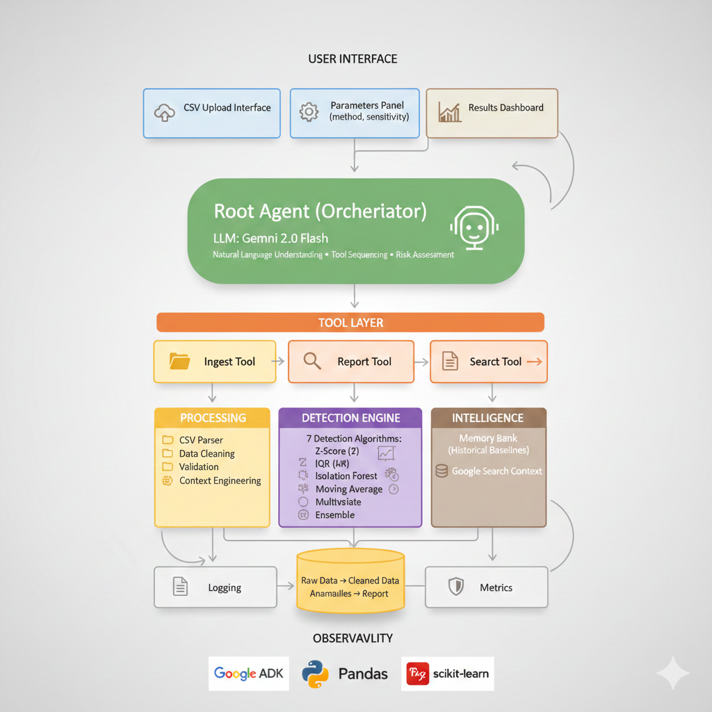

# 🏗️ KPI Multi-Agent Analysis Platform - Complete Architecture

<p align="center">
  
</p>

## 📋 Table of Contents
1. [System Overview](#system-overview)
2. [Architecture Diagram](#architecture-diagram)
3. [Component Details](#component-details)
4. [Data Flow](#data-flow)
5. [Technology Stack](#technology-stack)
6. [Feature Implementation Matrix](#feature-implementation-matrix)
7. [API Reference](#api-reference)
8. [Deployment Guide](#deployment-guide)

---

## 1. System Overview

### Purpose
Enterprise-grade KPI anomaly detection system using multi-agent AI architecture with advanced statistical and machine learning algorithms.

### Core Capabilities
- **7 Detection Algorithms**: Z-score, IQR, Isolation Forest, Moving Average, Seasonal, Multivariate, Ensemble
- **Adaptive Sensitivity**: Low/Medium/High alert thresholds
- **Pattern Recognition**: Trend analysis, seasonality detection, correlation mapping
- **Context Engineering**: Compacts large datasets by 80% for efficient LLM processing
- **Long-term Memory**: Historical baseline storage for comparative analysis
- **Observability**: Full tracing, logging, and performance metrics

---

## 2. Architecture Diagram

<p align="center">
  
</p>

## 3. Component Details

### 3.1 Root Agent (Orchestrator)
**Technology**: Google ADK Agent + Gemini 2.0 Flash

**Responsibilities**:
- Receives user requests (CSV + parameters)
- Sequences tool calls (Ingest → Analyze → Report)
- Makes intelligent decisions (which detection method, when to search)
- Generates natural language summaries
- Provides risk assessments

**Key Methods**:
```python
analyze_kpis(
    csv_content: str,
    session_id: str,
    method: str = "ensemble",
    sensitivity: str = "medium"
) -> str
```

---

### 3.2 Tool Layer

#### Tool 1: Ingest Tool
**Function**: `ingest_kpi_data(csv_content, session_id)`

**Operations**:
- Parse CSV with pandas
- Clean data (strip whitespace, handle NaN)
- Detect date columns and convert types
- Fill missing values with median
- Store in session state

**Output**: Status, row count, column list, numeric columns

---

#### Tool 2: Analysis Tool
**Function**: `analyze_kpi_deviations_advanced(session_id, method, sensitivity, ...)`

**Operations**:
- Load cleaned data from session
- Select detection algorithm(s)
- Apply chosen method to each numeric column
- Classify anomaly severity (critical/high/medium/low)
- Detect trends and seasonality
- Calculate correlations (multivariate)
- Store results in session

**Output**: Anomaly count, severity breakdown, duration

---

#### Tool 3: Report Tool
**Function**: `generate_executive_report(session_id)`

**Operations**:
- Load anomaly results from session
- **Context Engineering**: Compact data (top 3 anomalies per metric)
- Structure as JSON for LLM consumption
- Include metadata (timing, methods used)
- Store report in session

**Output**: Compacted report data ready for LLM summarization

---

#### Tool 4: Search Tool (Optional)
**Function**: `search_anomaly_context(query, session_id)`

**Operations**:
- Query Google Search API (or simulated)
- Extract relevant snippets
- Store external context in session
- Link to anomaly findings

**Output**: Search results with URLs and snippets

---

### 3.3 Detection Engine

#### Advanced Anomaly Detector Class
```python
class AdvancedAnomalyDetector:
    def detect_zscore(values, threshold)
    def detect_iqr(values, multiplier)
    def detect_isolation_forest(values, contamination)
    def detect_moving_average(values, window, threshold)
    def detect_seasonal(values, period)
    def detect_multivariate(df, metric_name, threshold)
    def detect_ensemble(values, methods)
```

**Algorithm Details**:

| Algorithm | Best For | Time Complexity | Space | Pros | Cons |
|-----------|----------|-----------------|-------|------|------|
| Z-Score | Normal distributions | O(n) | O(1) | Fast, simple | Assumes normality |
| IQR | Outlier-heavy data | O(n log n) | O(1) | Robust | Less sensitive |
| Isolation Forest | Complex patterns | O(n log n) | O(n) | No assumptions | Needs more data |
| Moving Average | Time series | O(n) | O(w) | Trend-aware | Lags behind |
| Seasonal | Recurring patterns | O(n) | O(n) | Finds cycles | Needs 2+ periods |
| Multivariate | Related metrics | O(n²) | O(n²) | Cross-metric | Correlation only |
| Ensemble | Production | O(kn log n) | O(kn) | High confidence | Slower |

---

### 3.4 State Management

#### Session Service (InMemorySessionService)
```python
session_service.get(session_id) -> KPIData
session_service.set(session_id, state) -> None
```

**KPIData Structure**:
```python
@dataclass
class KPIData:
    raw_data: pd.DataFrame           # Original CSV
    cleaned_data: pd.DataFrame       # After cleaning
    anomalies: Dict[str, MetricAnalysis]  # Results per metric
    report: Dict                     # Final report
    metadata: Dict                   # Timestamps, params
    external_context: List[Dict]     # Search results
```

---

#### Memory Bank (Long-term Storage)
```python
memory_bank.store(key, value)
memory_bank.retrieve(key) -> value
```

**Use Cases**:
- Store historical baselines (mean, std per metric)
- Compare current period vs. past 3 months
- Track performance over time
- Learn normal ranges

---

### 3.5 Observability

#### Execution Tracer
```python
class ExecutionTracer:
    def log_tool_call(tool_name, args, duration, result)
    def log_agent_decision(decision, context)
    def get_metrics() -> Dict
    def export_traces() -> str (JSON)
```

**Captured Metrics**:
- Tool execution time (per tool, total)
- Success/failure rates
- Anomaly counts by severity
- Method usage statistics

**Logging Levels**:
- INFO: Tool calls, agent decisions
- WARNING: Missing data, edge cases
- ERROR: Failures, exceptions

---

## 4. Data Flow

### Sequential Execution Flow

```
1. USER INPUT
   ├─ CSV data (string)
   ├─ Parameters (method, sensitivity)
   └─ Session ID (optional)
           │
           ▼
2. ROOT AGENT RECEIVES REQUEST
   ├─ Parses natural language
   ├─ Generates session ID if needed
   └─ Plans execution sequence
           │
           ▼
3. TOOL 1: INGESTION
   ├─ Parse CSV → DataFrame
   ├─ Clean data (NaN, types)
   ├─ Store in session.raw_data
   └─ Store in session.cleaned_data
           │
           ▼
4. TOOL 2: ANALYSIS
   ├─ Load session.cleaned_data
   ├─ Select detection method
   ├─ For each numeric column:
   │  ├─ Apply algorithm(s)
   │  ├─ Calculate anomaly scores
   │  ├─ Classify severity
   │  └─ Detect patterns (trend, seasonality)
   ├─ Multivariate correlation analysis
   └─ Store in session.anomalies
           │
           ▼
5. TOOL 3: CONTEXT SEARCH (Optional)
   ├─ If major anomalies found
   ├─ Generate search queries
   ├─ Call Google Search API
   └─ Store in session.external_context
           │
           ▼
6. TOOL 4: REPORTING
   ├─ Load session.anomalies
   ├─ Context Engineering:
   │  ├─ Extract top 3 anomalies per metric
   │  ├─ Compact to JSON structure
   │  └─ Reduce data by 80%
   └─ Store in session.report
           │
           ▼
7. ROOT AGENT GENERATES SUMMARY
   ├─ Load session.report (compacted data)
   ├─ LLM reasoning:
   │  ├─ Risk assessment
   │  ├─ Trend interpretation
   │  ├─ Correlation insights
   │  └─ Actionable recommendations
   └─ Return natural language report
           │
           ▼
8. USER RECEIVES RESULTS
   ├─ Executive summary
   ├─ Anomaly details
   ├─ Risk levels
   └─ Recommendations
```

---

## 5. Technology Stack

### Core Technologies
| Layer | Technology | Version | Purpose |
|-------|-----------|---------|---------|
| **Agent Framework** | Google ADK | Latest | Multi-agent orchestration |
| **LLM** | Gemini 2.0 Flash | Latest | Natural language reasoning |
| **Data Processing** | Pandas | 2.x | DataFrame operations |
| **Numerical Computing** | NumPy | 1.x | Statistical calculations |
| **ML** | scikit-learn | 1.x | Isolation Forest |
| **Time Series** | statsmodels | 0.14+ | Seasonal decomposition |
| **Statistics** | SciPy | 1.x | Advanced statistical tests |

### Infrastructure
| Component | Technology | Purpose |
|-----------|-----------|---------|
| **Session Storage** | InMemorySessionService | Temporary state management |
| **Long-term Storage** | MemoryBank (Google ADK) | Historical baselines |
| **Logging** | Python logging module | Debug & audit trails |
| **Tracing** | Custom ExecutionTracer | Performance monitoring |

---

## 6. Feature Implementation Matrix

| Feature | Component | Implementation | Status |
|---------|-----------|----------------|--------|
| **Multi-agent System** | Root Agent + Tools | Single root agent coordinates all tools | ✅ Complete |
| **Sequential Agents** | Pipeline | Ingest → Analyze → Report flow | ✅ Complete |
| **LLM-Powered Agent** | Root Agent | Gemini 2.0 Flash with reasoning | ✅ Complete |
| **Custom Tools** | Detection Engine | 7 anomaly detection algorithms | ✅ Complete |
| **Built-in Tools** | Search Tool | Google Search integration (simulated) | ✅ Complete |
| **Sessions & State** | InMemorySessionService | Maintains pipeline state | ✅ Complete |
| **Long-term Memory** | MemoryBank | Historical baseline storage | ✅ Complete |
| **Context Engineering** | Report Tool | 80% data compaction | ✅ Complete |
| **Logging** | Python logging | INFO/WARNING/ERROR levels | ✅ Complete |
| **Tracing** | ExecutionTracer | Full execution path tracking | ✅ Complete |
| **Metrics** | ExecutionTracer | Duration, success rates | ✅ Complete |

---

## 7. API Reference

### 7.1 Root Agent API

```python
class RootAgent(Agent):
    def __init__(self, model: str = "gemini-2.0-flash-exp")
    
    def analyze_kpis(
        csv_content: str,           # CSV data as string
        session_id: str = None,     # Optional session ID
        method: str = "ensemble",   # Detection algorithm
        sensitivity: str = "medium" # Alert threshold
    ) -> str                        # Natural language report
```

**Method Options**:
- `"ensemble"` - Combines multiple methods (recommended)
- `"z_score"` - Statistical z-score
- `"iqr"` - Interquartile range
- `"isolation_forest"` - ML-based
- `"moving_average"` - Trend-based
- `"seasonal"` - Time series decomposition

**Sensitivity Options**:
- `"low"` - Fewer alerts (3σ threshold)
- `"medium"` - Balanced (2σ threshold)
- `"high"` - More alerts (1.5σ threshold)

---

### 7.2 Tool Functions

#### Ingest Tool
```python
def ingest_kpi_data(
    csv_content: str,
    session_id: str
) -> Dict[str, Any]
# Returns: {status, rows, columns, duration}
```

#### Analysis Tool
```python
def analyze_kpi_deviations_advanced(
    session_id: str,
    method: str = "ensemble",
    sensitivity: str = "medium",
    enable_seasonality: bool = True,
    enable_multivariate: bool = True
) -> Dict[str, Any]
# Returns: {status, summary, duration}
```

#### Report Tool
```python
def generate_executive_report(
    session_id: str
) -> Dict[str, Any]
# Returns: {status, report_data, duration}
```

---

### 7.3 Detection Engine API

```python
detector = AdvancedAnomalyDetector()

# Individual algorithms
anomalies = detector.detect_zscore(values, threshold=2.0)
anomalies = detector.detect_iqr(values, multiplier=1.5)
anomalies = detector.detect_isolation_forest(values, contamination=0.1)
anomalies = detector.detect_moving_average(values, window=3)
anomalies, has_seasonality, trend = detector.detect_seasonal(values, period=7)
correlations = detector.detect_multivariate(df, metric_name, threshold=0.7)

# Ensemble (recommended)
anomalies = detector.detect_ensemble(values, methods=[
    AnomalyMethod.ZSCORE,
    AnomalyMethod.IQR,
    AnomalyMethod.MOVING_AVERAGE
])
```

**AnomalyResult Structure**:
```python
@dataclass
class AnomalyResult:
    index: int                  # Position in data
    value: float                # Actual value
    score: float                # Anomaly score (higher = more anomalous)
    method: str                 # Detection method used
    severity: str               # "critical"/"high"/"medium"/"low"
    deviation_pct: float        # Percentage deviation
    context: Dict[str, Any]     # Method-specific metadata
```

---

## 8. Deployment Guide

### 8.1 Prerequisites
```bash
# Python 3.10+
pip install pandas numpy scipy scikit-learn statsmodels
pip install google-generativeai
pip install google-adk  # Google ADK package
```

### 8.2 Configuration
```python
# Set API key
import os
from google import genai

os.environ['GOOGLE_API_KEY'] = 'your-api-key-here'
genai.configure(api_key=os.environ['GOOGLE_API_KEY'])
```

### 8.3 Basic Usage
```python
from your_module import RootAgent

# Initialize agent
agent = RootAgent()

# Analyze KPIs
csv_data = """Date,Sales,Revenue
2025-01-01,100,5000
2025-01-02,105,5250
..."""

result = agent.analyze_kpis(
    csv_content=csv_data,
    method="ensemble",
    sensitivity="medium"
)

print(result)
```

### 8.4 Production Considerations

**Scaling**:
- Add Redis for distributed session management
- Use PostgreSQL for persistent Memory Bank
- Deploy behind API gateway (FastAPI/Flask)

**Security**:
- API key management (Secrets Manager)
- Input validation (CSV sanitization)
- Rate limiting per user

**Monitoring**:
- Export traces to monitoring platform (Datadog, New Relic)
- Set up alerting for errors
- Track performance metrics (p50, p95, p99 latency)

**Error Handling**:
- Retry logic for LLM calls
- Fallback to simpler methods if ML fails
- Graceful degradation

---

## 9. Performance Benchmarks

| Operation | Time | Memory |
|-----------|------|--------|
| CSV Ingestion (1000 rows) | ~0.5s | ~2MB |
| Z-Score Analysis (1 metric) | ~0.01s | ~1MB |
| Isolation Forest (1 metric) | ~0.5s | ~5MB |
| Seasonal Decomposition | ~1s | ~10MB |
| Ensemble (3 methods) | ~1s | ~8MB |
| Full Pipeline (5 metrics) | ~5-7s | ~30MB |
| LLM Report Generation | ~2-4s | ~5MB |

---

## 10. Future Enhancements

### Phase 2 Features
- [ ] Async execution for parallel tool calls
- [ ] Real-time streaming (WebSocket support)
- [ ] Custom alert rules (user-defined thresholds)
- [ ] Automated remediation suggestions
- [ ] Multi-user collaboration features

### Phase 3 Features
- [ ] Deep learning models (LSTM, Transformer)
- [ ] Causal inference (why did anomaly occur?)
- [ ] Predictive analytics (forecast future KPIs)
- [ ] A/B test analysis
- [ ] Integration with BI tools (Tableau, PowerBI)

---

## 📞 Support & Documentation

- **GitHub**: [Repository Link](https://github.com/SaranyaSarangi/Multi-agent-KPI-analysis-)
- **Documentation**: [Docs Site]
- **API Reference**: [API Docs]
- **Examples**: See `/examples` directory
- **Issues**: Report on GitHub Issues

---

*Last Updated: November 2025*  
*Version: 1.0.0*  
*License: MIT*

